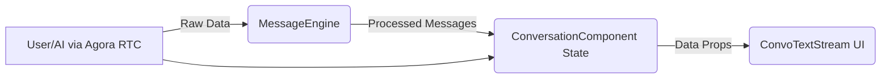
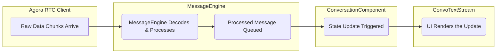
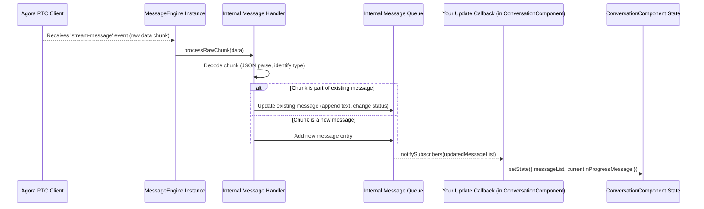

# Let's Talk Text: Streaming Transcriptions in Your Conversational AI App

So, you've built an amazing conversational AI app using Agora, maybe following our main [Conversational AI Guide](./GUIDE.md). Your users can chat with an AI, just like talking to a person. But what about _seeing_ the conversation? That's where text streaming comes in.

This guide focuses specifically on adding real-time text transcriptions to your audio-based AI conversations. Think of it as subtitles for your AI chat.

Why bother adding text when the primary interaction is voice? Good question! Here's why it's a game-changer:

1.  **Accessibility is Key**: Text opens up your app to users with hearing impairments. Inclusivity matters!
2.  **Memory Aid**: Let's be honest, we all forget things. A text transcript lets users quickly scan back through the conversation.
3.  **Loud Places, No Problem**: Ever tried having a voice call in a noisy cafe? Text transcriptions ensure the message gets through, even if the audio is hard to hear.
4.  **Did it Hear Me Right?**: Seeing the transcription confirms the AI understood the user correctly (or reveals when it didn't!).
5.  **Beyond Voice**: Sometimes, information like lists, code snippets, or website URLs are just easier to digest visually. Text streaming enables true multi-modal interaction.

Ready to add this superpower to your app? Let's dive in.

## The Blueprint: How Text Streaming Fits In

Adding text streaming involves three main players in your codebase:

1.  **The Brains (`lib/message.ts`)**: This is the `MessageEngine`, provided by Agora. It's the core logic unit that receives raw transcription data, figures out what's what, keeps track of message states (like "is the AI still talking?"), and manages the flow.
2.  **The Face (`components/ConvoTextStream.tsx`)**: This is your UI component. It takes the processed messages from the `MessageEngine` and displays them prettily. Think chat bubbles, scrolling, and maybe some cool animations for streaming text. We provide an example, but feel free to customize it to match your app's look and feel.
3.  **The Conductor (`components/ConversationComponent.tsx`)**: This is likely your existing component that handles the Agora RTC connection, microphone access, and manages the overall conversation flow. It acts as the central hub, connecting the `MessageEngine` to the UI (`ConvoTextStream`).

Here's a simplified view of how they communicate with each other:



Essentially, the raw data comes from Agora, the `MessageEngine` makes sense of it, updates the main `ConversationComponent`'s state, which then passes the necessary info down to the `ConvoTextStream` to show the user.

## Following the Data: The Message Lifecycle

Understanding how a single transcription message travels from the network to the screen is key:



1.  **RTC Stream**: Tiny packets of data containing transcription info arrive via the Agora RTC client. This could be a snippet of what the user said or what the AI is saying.
2.  **Message Processing**: The `MessageEngine` grabs these raw chunks, figures out if they belong to the user or the AI, and whether the message is finished or still incoming.
3.  **Message Queue**: To keep things orderly, processed messages (or message updates) are briefly queued.
4.  **State Updates**: The `MessageEngine` notifies the `ConversationComponent` (via a callback you provide) that the list of messages has changed. The `ConversationComponent` updates its React state.
5.  **UI Rendering**: React detects the state change and re-renders the `ConvoTextStream` component with the new message list, displaying the latest text to the user.

This efficient pipeline ensures that text appears smoothly and in real-time, correctly handling messages that are still being typed out ("in-progress"), fully delivered ("completed"), or cut off ("interrupted").

## Decoding the Data: Message Types

The `MessageEngine` needs to understand different kinds of transcription messages flowing through the RTC data channel. Here are the main ones:

### User Transcriptions (What the User Said)

```typescript
// Represents a transcription of the user's speech
export interface IUserTranscription extends ITranscriptionBase {
  object: ETranscriptionObjectType.USER_TRANSCRIPTION; // Identifies as "user.transcription"
  final: boolean; // Is this the final, complete transcription? (true/false)
}
```

This tells us what the speech-to-text system thinks the user said. The `final` flag is important – intermediate results might change slightly.

### Agent Transcriptions (What the AI is Saying)

```typescript
// Represents a transcription of the AI agent's speech
export interface IAgentTranscription extends ITranscriptionBase {
  object: ETranscriptionObjectType.AGENT_TRANSCRIPTION; // Identifies as "assistant.transcription"
  quiet: boolean; // Was this generated during a quiet period? (Useful for debugging)
  turn_seq_id: number; // Unique ID for this conversational turn
  turn_status: EMessageStatus; // Is this message IN_PROGRESS, END, or INTERRUPTED?
}
```

This is the text the AI is generating, often sent word-by-word or phrase-by-phrase to the text-to-speech engine _and_ to our `MessageEngine` for display. The `turn_status` is crucial for knowing when the AI starts and finishes speaking.

### Message Interruptions

```typescript
// Signals that a previous message was interrupted
export interface IMessageInterrupt {
  object: ETranscriptionObjectType.MSG_INTERRUPTED; // Identifies as "message.interrupt"
  message_id: string; // Which message got interrupted?
  data_type: 'message';
  turn_id: number; // The turn ID of the interrupted message
  start_ms: number; // Timestamp info
  send_ts: number; // Timestamp info
}
```

This happens if, for example, the user starts talking while the AI is still speaking. The `MessageEngine` uses this to mark the AI's interrupted message accordingly in the UI.

The `MessageEngine` intelligently handles these different types:

- User messages often arrive as complete thoughts.
- Agent messages frequently stream in piece by piece.
- Interruptions update the status of messages already being processed.

It juggles all this using an internal queue and state management so your UI component doesn't have to worry about the raw complexity.

## Meet the `MessageEngine`: The Heart of Text Streaming

The `MessageEngine` (`lib/message.ts`) is where the magic happens. You don't need to build it; Agora provides it. Its main jobs are:

1.  **Listening**: It hooks into the Agora RTC client to receive those raw transcription data messages.
2.  **Processing**: It decodes the messages, identifies who sent them (user or AI), and figures out their status.
3.  **Managing State**: It keeps track of whether each message is still streaming (`IN_PROGRESS`), finished (`END`), or was cut off (`INTERRUPTED`).
4.  **Ordering & Buffering**: It ensures messages are handled in the correct sequence, even if network packets arrive slightly out of order.
5.  **Notifying**: It tells your `ConversationComponent` (via a callback) whenever the list of displayable messages changes.

### Key Concepts Inside the Engine

#### Message Status: Is it Done Yet?

Every message tracked by the engine has a status:

```typescript
export enum EMessageStatus {
  IN_PROGRESS = 0, // Still being received/streamed (e.g., AI is talking)
  END = 1, // Finished normally.
  INTERRUPTED = 2, // Cut off before completion.
}
```

This helps your UI know how to display each message (e.g., add a "..." or a pulsing animation for `IN_PROGRESS` messages).

#### Engine Modes: How Granular Do You Want To Be?

The engine can process incoming agent text in different ways:

```typescript
export enum EMessageEngineMode {
  TEXT = 'text', // Treats each agent message chunk as a complete block. Simpler, less "streaming" feel.
  WORD = 'word', // Processes agent messages word-by-word if timing info is available. Gives that nice streaming effect.
  AUTO = 'auto', // The engine decides! If word timings are present, it uses WORD mode; otherwise, TEXT mode. (Recommended)
}
```

Using `AUTO` mode is generally the easiest way to start. The engine adapts based on the data it receives from the backend conversational AI service. If the service sends detailed word timings, you get smooth streaming; if not, it falls back gracefully to showing text blocks.

#### The Output: What Your UI Gets

The `MessageEngine` ultimately provides your application (via its callback) with a list of message objects ready for display:

```typescript
export interface IMessageListItem {
  uid: number | string; // Who sent this? User's numeric UID or Agent's string/numeric UID (often 0 or a specific string like "Agent").
  turn_id: number; // Helps keep track of conversational turns.
  text: string; // The actual words to display.
  status: EMessageStatus; // The current status (IN_PROGRESS, END, INTERRUPTED).
}
```

Your UI component just needs to render a list of these objects.

### Wiring Up the Engine

You'll typically initialize the `MessageEngine` within your main `ConversationComponent`, probably inside a `useEffect` hook that runs once the Agora RTC `client` is ready.

```typescript
// Inside ConversationComponent.tsx

const client = useRTCClient(); // Get the Agora client instance
const [messageList, setMessageList] = useState<IMessageListItem[]>([]);
const [currentInProgressMessage, setCurrentInProgressMessage] =
  useState<IMessageListItem | null>(null);
const messageEngineRef = useRef<MessageEngine | null>(null);
const agentUID = process.env.NEXT_PUBLIC_AGENT_UID || 'Agent'; // Get your agent's expected UID

useEffect(() => {
  // Only initialize once the client exists and we haven't already started the engine
  if (client && !messageEngineRef.current) {
    console.log('Initializing MessageEngine...');

    // Create the engine instance
    const engine = new MessageEngine(
      client,
      EMessageEngineMode.AUTO, // Use AUTO mode for adaptive streaming
      // This callback function is the critical link!
      // It receives the updated message list whenever something changes.
      (updatedMessages: IMessageListItem[]) => {
        // 1. Always sort messages by turn_id to ensure chronological order
        const sortedMessages = [...updatedMessages].sort(
          (a, b) => a.turn_id - b.turn_id
        );

        // 2. Find the *latest* message that's still streaming (if any)
        // We handle this separately for smoother UI updates during streaming.
        const inProgressMsg = sortedMessages.findLast(
          (msg) => msg.status === EMessageStatus.IN_PROGRESS
        );

        // 3. Update component state:
        //    - messageList gets all *completed* or *interrupted* messages.
        //    - currentInProgressMessage gets the single *latest* streaming message.
        setMessageList(
          sortedMessages.filter(
            (msg) => msg.status !== EMessageStatus.IN_PROGRESS
          )
        );
        setCurrentInProgressMessage(inProgressMsg || null);
      }
    );

    // Store the engine instance in a ref
    messageEngineRef.current = engine;

    // Start the engine's processing loop
    // legacyMode: false is recommended for newer setups
    messageEngineRef.current.run({ legacyMode: false });
    console.log('MessageEngine started.');
  }

  // Cleanup function: Stop the engine when the component unmounts
  return () => {
    if (messageEngineRef.current) {
      console.log('Cleaning up MessageEngine...');
      messageEngineRef.current.cleanup();
      messageEngineRef.current = null;
    }
  };
}, [client]); // Dependency array ensures this runs when the client is ready
```

Let's break down that crucial callback function:

1.  **Sort**: Messages might arrive slightly out of sync; sorting by `turn_id` fixes that.
2.  **Separate**: We treat the _very last_ `IN_PROGRESS` message differently from the others. This allows the UI to potentially render it with a special streaming effect without re-rendering the entire list constantly.
3.  **Update State**: Setting the `messageList` (completed/interrupted messages) and `currentInProgressMessage` triggers a React re-render, passing the fresh data to your `ConvoTextStream` component.

## Building the UI: The `ConvoTextStream` Component

Now, let's look at the example `ConvoTextStream` component (`components/ConvoTextStream.tsx`). Its job is to take the message data from the `ConversationComponent` and make it look like a chat interface.

### Inputs (Props)

It needs data from its parent (`ConversationComponent`):

```typescript
interface ConvoTextStreamProps {
  // All the messages that are done (completed or interrupted)
  messageList: IMessageListItem[];
  // The single message currently being streamed by the AI (if any)
  currentInProgressMessage?: IMessageListItem | null;
  // The UID of the AI agent (so we can style its messages differently)
  agentUID: string | number | undefined;
}
```

These props are directly populated from the state variables (`messageList`, `currentInProgressMessage`) that our `MessageEngine` callback updates in the `ConversationComponent`.

### Core UX Features

A good chat UI needs more than just displaying text. Our example focuses on:

#### Smart Scrolling

Users hate losing their place when new messages arrive, _unless_ they're already at the bottom wanting to see the latest.

```typescript
// Ref for the scrollable chat area
const scrollRef = useRef<HTMLDivElement>(null);
// State to track if we should automatically scroll down
const [shouldAutoScroll, setShouldAutoScroll] = useState(true);

// Function to force scroll to the bottom
const scrollToBottom = () => {
  scrollRef.current?.scrollTo({
    top: scrollRef.current.scrollHeight,
    behavior: 'smooth', // Optional: make it smooth
  });
};

// Detects when the user scrolls manually
const handleScroll = () => {
  if (!scrollRef.current) return;
  const { scrollHeight, scrollTop, clientHeight } = scrollRef.current;
  // Is the user within ~100px of the bottom?
  const isNearBottom = scrollHeight - scrollTop - clientHeight < 100;
  // Only auto-scroll if the user is near the bottom
  if (isNearBottom !== shouldAutoScroll) {
    setShouldAutoScroll(isNearBottom);
  }
};

// Effect to actually perform the auto-scroll when needed
useEffect(() => {
  // Check if a new message arrived OR if we should be auto-scrolling
  const hasNewMessage = messageList.length > prevMessageLengthRef.current; // Track previous length

  if ((hasNewMessage || shouldAutoScroll) && scrollRef.current) {
    scrollToBottom();
  }

  // Update previous length ref for next render
  prevMessageLengthRef.current = messageList.length;
}, [messageList, currentInProgressMessage?.text, shouldAutoScroll]); // Re-run when messages change or scroll state changes

// Add the onScroll handler to the scrollable div
// <div ref={scrollRef} onScroll={handleScroll} className="overflow-auto...">
```

This logic ensures:

- If the user scrolls up to read history, the view stays put.
- If the user is at the bottom, new messages automatically scroll into view.

#### Throttled Scrolling During Streaming (Optional Enhancement)

The previous `useEffect` for scrolling might trigger on _every single word_ update if using `WORD` mode. This can feel jittery. We can improve this by only scrolling significantly when _enough_ new text has arrived.

```typescript
// --- Add these refs ---
const prevMessageTextRef = useRef(''); // Track the text of the last in-progress message
const significantChangeScrollTimer = useRef<NodeJS.Timeout | null>(null); // Timer ref

// --- New function to check for significant change ---
const hasContentChangedSignificantly = (threshold = 20): boolean => {
  if (!currentInProgressMessage) return false;

  const currentText = currentInProgressMessage.text || '';
  const textLengthDiff = currentText.length - prevMessageTextRef.current.length;

  // Only trigger if a decent chunk of text arrived
  const hasSignificantChange = textLengthDiff >= threshold;

  // Update the ref *only if* it changed significantly
  if (
    hasSignificantChange ||
    currentInProgressMessage.status !== EMessageStatus.IN_PROGRESS
  ) {
    prevMessageTextRef.current = currentText;
  }

  return hasSignificantChange;
};

// --- Modify the scrolling useEffect ---
useEffect(() => {
  const hasNewCompleteMessage =
    messageList.length > prevMessageLengthRef.current;
  const streamingContentChanged = hasContentChangedSignificantly(); // Use the new check

  // Clear any pending scroll timer if conditions change
  if (significantChangeScrollTimer.current) {
    clearTimeout(significantChangeScrollTimer.current);
    significantChangeScrollTimer.current = null;
  }

  if (
    (hasNewCompleteMessage || (streamingContentChanged && shouldAutoScroll)) &&
    scrollRef.current
  ) {
    // Introduce a small delay to batch scrolls during rapid streaming
    significantChangeScrollTimer.current = setTimeout(() => {
      scrollToBottom();
      significantChangeScrollTimer.current = null;
    }, 50); // 50ms delay, adjust as needed
  }

  prevMessageLengthRef.current = messageList.length;

  // Cleanup timer on unmount
  return () => {
    if (significantChangeScrollTimer.current) {
      clearTimeout(significantChangeScrollTimer.current);
    }
  };
}, [messageList, currentInProgressMessage?.text, shouldAutoScroll]);
```

This refined approach checks if more than, say, 20 characters have been added to the streaming message before triggering a scroll, making the experience smoother. It also uses a small `setTimeout` to batch scrolls that happen in quick succession.

#### Displaying the Streaming Message

We need to decide when and how to show the `currentInProgressMessage`:

```typescript
// Helper to decide if the streaming message should be shown
const shouldShowStreamingMessage = (): boolean => {
  return (
    // Is there an in-progress message?
    currentInProgressMessage !== null &&
    // Is it *actually* in progress?
    currentInProgressMessage.status === EMessageStatus.IN_PROGRESS &&
    // Does it have any text content yet?
    currentInProgressMessage.text.trim().length > 0
  );
};

// In the JSX, combine the lists for rendering:
const allMessagesToRender = [...messageList];
if (shouldShowStreamingMessage() && currentInProgressMessage) {
  // Add the streaming message to the end of the list to be rendered
  allMessagesToRender.push(currentInProgressMessage);
}

// Then map over `allMessagesToRender`
// {allMessagesToRender.map((message, index) => ( ... render message bubble ... ))}
```

This ensures we only render the streaming message bubble when it's actively receiving non-empty text.

#### Chat Controls (Toggle Open/Close, Expand)

Basic UI controls enhance usability:

```typescript
const [isOpen, setIsOpen] = useState(false); // Is the chat window visible?
const [isChatExpanded, setIsChatExpanded] = useState(false); // Is it in expanded mode?
const hasSeenFirstMessageRef = useRef(false); // Track if the user has interacted or seen the first message

// Toggle chat open/closed
const toggleChat = () => {
  const newState = !isOpen;
  setIsOpen(newState);
  // If opening, mark that the user has now 'seen' the chat
  if (newState) {
    hasSeenFirstMessageRef.current = true;
  }
};

// Toggle between normal and expanded height
const toggleChatExpanded = () => {
  setIsChatExpanded(!isChatExpanded);
};

// --- Auto-Open Logic ---
useEffect(() => {
  const hasAnyMessage = messageList.length > 0 || shouldShowStreamingMessage();

  // If there's a message, we haven't opened it yet automatically, and it's currently closed...
  if (hasAnyMessage && !hasSeenFirstMessageRef.current && !isOpen) {
    setIsOpen(true); // Open it!
    hasSeenFirstMessageRef.current = true; // Mark as seen/auto-opened
  }
}, [messageList, currentInProgressMessage, isOpen]); // Rerun when messages or open state change
```

This includes logic to automatically pop open the chat window the first time a message appears, but only if the user hasn't manually closed it or interacted with it before.

### Rendering the Messages

The core rendering logic maps over the combined message list (`allMessagesToRender`) and creates styled divs for each message:

```typescript
// Inside the map function:
<div
  key={`${message.turn_id}-${message.uid}-${index}`} // More robust key
  ref={index === allMessagesToRender.length - 1 ? lastMessageRef : null} // Ref for potential scrolling logic
  className={cn(
    'flex items-start gap-2 w-full mb-2', // Basic layout styles
    // Is this message from the AI? Align left. Otherwise, align right.
    message.uid === 0 || message.uid.toString() === agentUID
      ? 'justify-start'
      : 'justify-end'
  )}
>
  {/* Conditionally render Avatar based on sender if needed */}
  {/* {isAgent && <Avatar ... />} */}

  {/* Message Bubble */}
  <div
    className={cn(
      'max-w-[80%] rounded-xl px-3 py-2 text-sm md:text-base shadow-sm', // Slightly softer corners, shadow
      isAgent ? 'bg-gray-100 text-gray-800' : 'bg-blue-500 text-white',
      // Optional: Dim user message slightly if interrupted while IN_PROGRESS
      message.status === EMessageStatus.IN_PROGRESS && !isAgent && 'opacity-80'
    )}
  >
    {message.text}
  </div>
</div>
```

This uses `tailwindcss` and the `cn` utility for conditional classes to:

- Align user messages to the right, AI messages to the left.
- Apply different background colors.

## Putting It All Together: Integration in `ConversationComponent`

Integrating the `ConvoTextStream` into your main `ConversationComponent` is straightforward once the `MessageEngine` is initialized and managing state.

1.  **Initialize MessageEngine**: As shown in the "Wiring Up the Engine" section, set up the `MessageEngine` in a `useEffect` hook, providing the callback to update `messageList` and `currentInProgressMessage` state variables.
2.  **Render `ConvoTextStream`**: In the `ConversationComponent`'s return JSX, include the `ConvoTextStream` and pass the necessary props:

```typescript
// Inside ConversationComponent's return statement

// ... other UI elements like connection status, microphone button ...

return (
  <div className="relative flex flex-col h-full">
    {/* ... Other UI ... */}

    {/* Pass the state managed by MessageEngine's callback */}
    <ConvoTextStream
      messageList={messageList}
      currentInProgressMessage={currentInProgressMessage}
      agentUID={agentUID} // Pass the agent's UID
    />

    {/* ... Microphone Button etc ... */}
  </div>
);
```

And that's the core integration! The `MessageEngine` handles the data flow from RTC, updates the state in `ConversationComponent`, which then passes the formatted data down to `ConvoTextStream` for display.

## Making It Your Own: Styling and Customization

The provided `ConvoTextStream` is a starting point. You'll likely want to customize its appearance.

### Styling Message Bubbles

Modify the `tailwindcss` classes within `ConvoTextStream.tsx` to match your app's design system. Change colors, fonts, padding, border-radius, etc.

```typescript
// Example: Change AI bubble color
    message.uid === 0 || message.uid.toString() === agentUID
  ? 'bg-purple-100 text-purple-900' // Changed from gray
  : 'bg-blue-500 text-white',
```

### Chat Window Appearance

Adjust the positioning (`fixed`, `absolute`), size (`w-96`), background (`bg-white`), shadows (`shadow-lg`), etc., of the main chat container (`#chatbox` div and its children).

### Streaming Indicator

The `animate-pulse` class is a basic indicator. You could replace it with:

- A custom CSS animation.
- Adding an ellipsis (...) to the end of the `message.text`.
- Displaying a small typing indicator icon next to the bubble.

```typescript
// Example: Adding ellipsis instead of pulse
{
  message.text;
}
{
  message.status === EMessageStatus.IN_PROGRESS ? '...' : '';
}

// Remove the animate-pulse class if using ellipsis
// className={cn( ... , message.status === EMessageStatus.IN_PROGRESS && 'animate-pulse' )}
```

### Expanding/Collapsing Behavior

Modify the `toggleChatExpanded` function and the associated conditional classes (`isChatExpanded && 'expanded'`) to change how the chat window resizes or behaves when expanded. You might want it to take up more screen space or dock differently.

## Under the Hood: Message Processing Flow

For the curious, here's a slightly more detailed look at how the `MessageEngine` processes a single `stream-message` event from the Agora RTC data channel:



This shows the internal steps: receiving raw data, decoding it, updating or creating messages in an internal queue/store, and finally triggering your callback function to update the React component state.

## Full Component Code (`ConvoTextStream.tsx`)

```typescript
/* eslint-disable react-hooks/exhaustive-deps */
'use client';

import { useState, useEffect, useRef, useCallback } from 'react';
import { Button } from '@/components/ui/button';
import {
  MessageCircle,
  X,
  ChevronsUpDown, // Changed icon
  ArrowDownToLine, // Changed icon
  Expand, // Added icon for expand
  Shrink, // Added icon for shrink
} from 'lucide-react';
import { cn } from '@/lib/utils';
import { IMessageListItem, EMessageStatus } from '@/lib/message'; // Assuming types are here

interface ConvoTextStreamProps {
  messageList: IMessageListItem[];
  currentInProgressMessage?: IMessageListItem | null;
  agentUID: string | number | undefined; // Allow number or string
}

export default function ConvoTextStream({
  messageList,
  currentInProgressMessage = null,
  agentUID,
}: ConvoTextStreamProps) {
  const [isOpen, setIsOpen] = useState(false);
  const [shouldAutoScroll, setShouldAutoScroll] = useState(true);
  const scrollRef = useRef<HTMLDivElement>(null);
  const prevMessageLengthRef = useRef(messageList.length);
  const prevMessageTextRef = useRef('');
  const [isChatExpanded, setIsChatExpanded] = useState(false);
  const hasSeenFirstMessageRef = useRef(false);
  const significantChangeScrollTimer = useRef<NodeJS.Timeout | null>(null);

  // --- Scrolling Logic ---

  const scrollToBottom = useCallback(() => {
    if (scrollRef.current) {
      scrollRef.current.scrollTo({
        top: scrollRef.current.scrollHeight,
        behavior: 'smooth',
      });
    }
  }, []);

  const handleScroll = useCallback(() => {
    if (!scrollRef.current) return;
    const { scrollHeight, scrollTop, clientHeight } = scrollRef.current;
    const isNearBottom = scrollHeight - scrollTop - clientHeight < 150; // Increased threshold slightly
    if (isNearBottom !== shouldAutoScroll) {
      setShouldAutoScroll(isNearBottom);
    }
  }, [shouldAutoScroll]);

  const hasContentChangedSignificantly = useCallback(
    (threshold = 20): boolean => {
      if (!currentInProgressMessage) return false;
      const currentText = currentInProgressMessage.text || '';
      // Only compare if the message is actually in progress
      const baseText =
        currentInProgressMessage.status === EMessageStatus.IN_PROGRESS
          ? prevMessageTextRef.current
          : currentText;
      const textLengthDiff = currentText.length - baseText.length;
      const hasSignificantChange = textLengthDiff >= threshold;

      // Update ref immediately if it's a significant change or message finished/interrupted
      if (
        hasSignificantChange ||
        currentInProgressMessage.status !== EMessageStatus.IN_PROGRESS
      ) {
        prevMessageTextRef.current = currentText;
      }
      return hasSignificantChange;
    },
    [currentInProgressMessage]
  );

  useEffect(() => {
    const hasNewCompleteMessage =
      messageList.length > prevMessageLengthRef.current;
    // Check significance *only* if we should be auto-scrolling
    const streamingContentChanged =
      shouldAutoScroll && hasContentChangedSignificantly();

    if (significantChangeScrollTimer.current) {
      clearTimeout(significantChangeScrollTimer.current);
      significantChangeScrollTimer.current = null;
    }

    if (
      (hasNewCompleteMessage || streamingContentChanged) &&
      scrollRef.current
    ) {
      // Debounce scrolling slightly
      significantChangeScrollTimer.current = setTimeout(() => {
        scrollToBottom();
        significantChangeScrollTimer.current = null;
      }, 50);
    }

    prevMessageLengthRef.current = messageList.length;

    return () => {
      if (significantChangeScrollTimer.current) {
        clearTimeout(significantChangeScrollTimer.current);
      }
    };
  }, [
    messageList,
    currentInProgressMessage?.text,
    shouldAutoScroll,
    scrollToBottom,
    hasContentChangedSignificantly,
  ]);

  // --- Component Logic ---

  const shouldShowStreamingMessage = useCallback((): boolean => {
    return (
      currentInProgressMessage !== null &&
      currentInProgressMessage.status === EMessageStatus.IN_PROGRESS &&
      currentInProgressMessage.text.trim().length > 0
    );
  }, [currentInProgressMessage]);

  const toggleChat = useCallback(() => {
    const newState = !isOpen;
    setIsOpen(newState);
    if (newState) {
      hasSeenFirstMessageRef.current = true; // Mark as seen if manually opened
    }
  }, [isOpen]);

  const toggleChatExpanded = useCallback(() => {
    setIsChatExpanded(!isChatExpanded);
    // Attempt to scroll to bottom after expanding/shrinking
    setTimeout(scrollToBottom, 50);
  }, [isChatExpanded, scrollToBottom]);

  // Auto-open logic
  useEffect(() => {
    const hasAnyMessage =
      messageList.length > 0 || shouldShowStreamingMessage();
    if (hasAnyMessage && !hasSeenFirstMessageRef.current && !isOpen) {
      setIsOpen(true);
      hasSeenFirstMessageRef.current = true;
    }
  }, [
    messageList,
    currentInProgressMessage,
    isOpen,
    shouldShowStreamingMessage,
  ]);

  // Combine messages for rendering
  const allMessagesToRender = [...messageList];
  if (shouldShowStreamingMessage() && currentInProgressMessage) {
    allMessagesToRender.push(currentInProgressMessage);
  }

  // --- JSX ---
  return (
    // Use a more descriptive ID if needed, ensure z-index is appropriate
    <div
      id="agora-text-stream-chatbox"
      className="fixed bottom-24 right-4 md:right-8 z-50"
    >
      {isOpen ? (
        <div
          className={cn(
            'bg-white rounded-lg shadow-xl w-80 md:w-96 flex flex-col text-black transition-all duration-300 ease-in-out', // Adjusted width and added transition
            // Dynamic height based on expanded state
            isChatExpanded ? 'h-[60vh] max-h-[500px]' : 'h-80'
          )}
        >
          {/* Header */}
          <div className="p-2 border-b flex justify-between items-center shrink-0 bg-gray-50 rounded-t-lg">
            <Button
              variant="ghost"
              size="icon"
              onClick={toggleChatExpanded}
              aria-label={isChatExpanded ? 'Shrink chat' : 'Expand chat'}
            >
              {isChatExpanded ? (
                <Shrink className="h-4 w-4" />
              ) : (
                <Expand className="h-4 w-4" />
              )}
            </Button>
            <h3 className="font-semibold text-sm md:text-base">Conversation</h3>
            <Button
              variant="ghost"
              size="icon"
              onClick={toggleChat}
              aria-label="Close chat"
            >
              <X className="h-4 w-4" />
            </Button>
          </div>

          {/* Message Area */}
          <div
            className="flex-1 overflow-y-auto scroll-smooth" // Use overflow-y-auto
            ref={scrollRef}
            onScroll={handleScroll}
          >
            <div className="p-3 md:p-4 space-y-3">
              {allMessagesToRender.map((message, index) => {
                const isAgent =
                  message.uid === 0 ||
                  message.uid?.toString() === agentUID?.toString();
                return (
                  <div
                    key={`${message.turn_id}-${message.uid}-${index}`} // Use index as last resort for key part
                    className={cn(
                      'flex items-start gap-2 w-full',
                      isAgent ? 'justify-start' : 'justify-end'
                    )}
                  >
                    {/* Optional: Render avatar only for AI or based on settings */}
                    {/* {isAgent && <Avatar ... />} */}

                    {/* Message Bubble */}
                    <div
                      className={cn(
                        'max-w-[80%] rounded-xl px-3 py-2 text-sm md:text-base shadow-sm', // Slightly softer corners, shadow
                        isAgent
                          ? 'bg-gray-100 text-gray-800'
                          : 'bg-blue-500 text-white'
                      )}
                    >
                      {message.text}
                    </div>
                  </div>
                );
              })}
              {/* Add a small spacer at the bottom */}
              <div className="h-2"></div>
            </div>
          </div>
          {/* Optional Footer Area (e.g., for input later) */}
          {/* <div className="p-2 border-t shrink-0">...</div> */}
        </div>
      ) : (
        // Floating Action Button (FAB) to open chat
        <Button
          onClick={toggleChat}
          className="rounded-full w-14 h-14 flex items-center justify-center bg-blue-600 hover:bg-blue-700 text-white shadow-lg hover:scale-105 transition-all duration-200"
          aria-label="Open chat"
        >
          <MessageCircle className="h-6 w-6" />
        </Button>
      )}
    </div>
  );
}
```

This example component provides:

- Collapsed FAB (Floating Action Button) state.
- Expandable chat window with smooth transitions.
- Improved scrolling logic with debouncing.
- Clearer styling distinctions between user and AI.
- Basic accessibility attributes (`aria-label`, `aria-live`).

Remember to adapt the styling, icons (`lucide-react` used here), and specific UX behaviors to fit your application's needs.

## The Big Picture: How it Connects in the Main App

Let's quickly recap the data flow within the context of the entire application:

1.  **User Speaks / AI Generates**: Audio happens in the Agora channel. Speech-to-Text (STT) and AI processing generate transcription data.
2.  **RTC Data Channel**: This data (user transcriptions, AI transcriptions, interrupts) is sent over the Agora RTC data channel.
3.  **`MessageEngine` Listens**: Your initialized `MessageEngine` picks up these `stream-message` events.
4.  **Engine Processes**: It decodes the data, manages message state (`IN_PROGRESS`, `END`, etc.), and maintains an ordered list.
5.  **Callback Triggered**: The engine calls the callback function you provided during initialization, passing the updated `IMessageListItem[]`.
6.  **`ConversationComponent` State Update**: Your callback function processes this list (sorts, separates in-progress) and calls `setMessageList` and `setCurrentInProgressMessage`.
7.  **React Re-renders**: The state update triggers a re-render of `ConversationComponent`.
8.  **`ConvoTextStream` Receives Props**: The `ConvoTextStream` component receives the fresh `messageList` and `currentInProgressMessage` as props.
9.  **UI Updates**: `ConvoTextStream` renders the new text, applies appropriate styles (like the pulse animation), and handles scrolling.

This cycle repeats rapidly as the conversation progresses, creating the real-time text streaming effect.

## Where to Go Next

You've now got the tools and understanding to add slick, real-time text streaming to your Agora conversational AI application! This isn't just a cosmetic addition; it significantly boosts usability and accessibility.

**Your next steps:**

1.  **Integrate**: Drop the `MessageEngine` initialization into your `ConversationComponent` and render the `ConvoTextStream` (or your custom version).
2.  **Customize**: Style the `ConvoTextStream` to perfectly match your app's design language. Tweak animations and scrolling behavior for the best UX.
3.  **Test**: Try it out in different scenarios – long messages, quick interruptions, noisy environments (if testing STT).
4.  **Refine**: Based on testing, adjust VAD settings in your backend or fine-tune the UI behavior.

For deeper dives into specific Agora features related to this, check out the [Official Documentation for "Live Subtitles"](https://docs.agora.io/en/conversational-ai/develop/subtitles?platform=web), which covers the underlying data channel mechanisms.

Happy building, and enjoy building more engaging and accessible conversational experiences!
