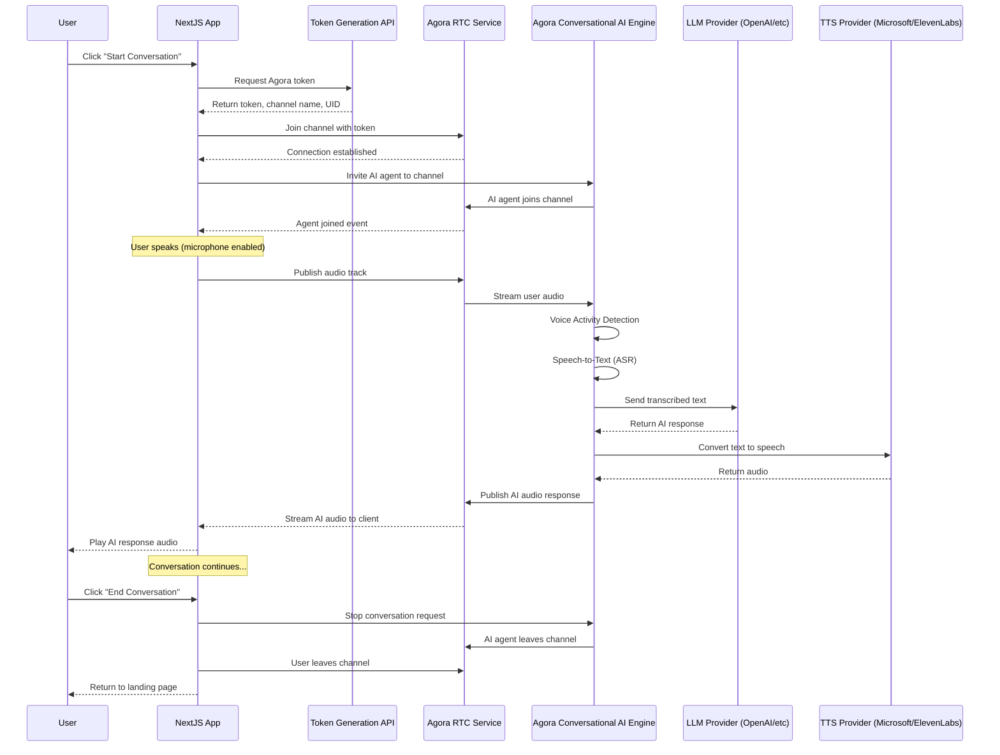

# User Interaction Diagram

This diagram shows the interaction between the user, the NextJS app, the Agora RTC service, the ConvoAI engine, the LLM provider, and the TTS provider.

```mermaid
sequenceDiagram
    participant User
    participant NextJS as NextJS App
    participant TokenAPI as Token Generation API
    participant AgoraRTC as Agora RTC Service
    participant ConvoAI as Agora Conversational AI Engine
    participant LLM as LLM Provider (OpenAI/etc)
    participant TTS as TTS Provider (Microsoft/ElevenLabs)

    User->>NextJS: Click "Start Conversation"
    NextJS->>TokenAPI: Request Agora token
    TokenAPI-->>NextJS: Return token, channel name, UID

    NextJS->>AgoraRTC: Join channel with token
    AgoraRTC-->>NextJS: Connection established

    NextJS->>ConvoAI: Invite AI agent to channel
    ConvoAI->>AgoraRTC: AI agent joins channel
    AgoraRTC-->>NextJS: Agent joined event

    Note over NextJS: User speaks (microphone enabled)
    NextJS->>AgoraRTC: Publish audio track
    AgoraRTC->>ConvoAI: Stream user audio

    ConvoAI->>ConvoAI: Voice Activity Detection
    ConvoAI->>ConvoAI: Speech-to-Text (ASR)
    ConvoAI->>LLM: Send transcribed text
    LLM-->>ConvoAI: Return AI response
    ConvoAI->>TTS: Convert text to speech
    TTS-->>ConvoAI: Return audio

    ConvoAI->>AgoraRTC: Publish AI audio response
    AgoraRTC-->>NextJS: Stream AI audio to client
    NextJS-->>User: Play AI response audio

    Note over NextJS: Conversation continues...

    User->>NextJS: Click "End Conversation"
    NextJS->>ConvoAI: Stop conversation request
    ConvoAI->>AgoraRTC: AI agent leaves channel
    NextJS->>AgoraRTC: User leaves channel
    NextJS-->>User: Return to landing page
```
